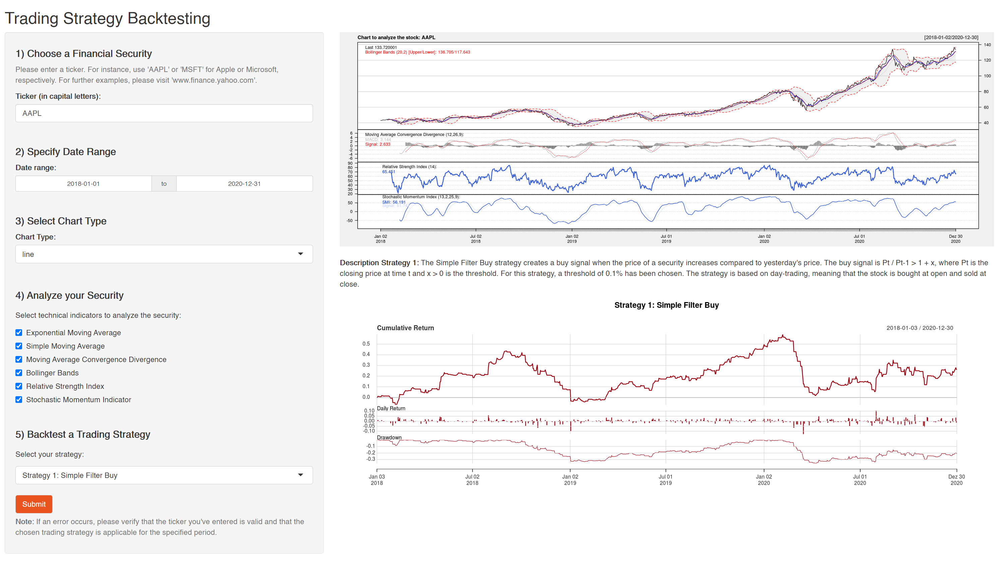

# TradingGeeks
The goal of this repository is to develop a program which can backtest trading strategies. The README.md is structured as follows:

1. Objectives of the App
2. Main Functionalities
3. Example Use Case
4. Programming Procedure
5. Structure of the App
6. Docker instructions

### 1) Objective of the App

Our application has 3 main objectives. First, the trading program assists a user in analysing a stock by means of different chart types and technical indicators for a specified period. Second, the application enables the back-testing of 6 simple trading strategies and depicts their respective performances. Lastly, the ultimate purpose of the app is to facilitate the analysis of stocks and trading strategies for a broad audience. A well-arranged user interface is the foundation to achieve that, and it makes it easy to experiment with different financial securities, technical indicators, and trading strategies.

### 2) Main Functionalities

The user interface (UI) allows the user to provide inputs to the program. The investor can **(1)** select an underlying, **(2)** define the date range, **(3)** select a preferred chart type, and **(4)** get a more detailed overview of the stock's performance with one of the predefined technical indicators. Next, **(5)3** the user can specify one of six trading strategies for the back-testing. After clicking on the "Submit" button, the Shiny app displays a non-technical report of the results on the right side. The data  in the program is obtained from Yahoo!Finance and from Twitter.

The output comprises two charts. On the top, the historical performance of the underlying with the selected technical indicators is visualized. On the bottom, the cumulative return of the chosen trading strategy is depicted, including daily returns and drawdowns. Between the two charts, a short description of the chosen trading strategy is displayed.

### 3) Example Use Case
This section explains the functionalities of the program by giving a specific example. If the user follows all steps of this turtorial, the following output should be visible:

 

To analyze the Apple stock, we **first** have to enter the ticker "AAPL". It is important to note that the ticker of the financial security must be indicated correctly, otherwise Yahoo!Finance will not be able to retrieve the data. 

**Second**, the date range can be specified. In this example, the closing prices of the Apple stock are retrieved from the 1st of January 2018 until the 31st of December 2020. The date range can be adjusted according to individual preferences. However, the longer the date range, the longer the program needs to load the data. Furthermore, an error message will be shown if the date range is too long and no data is available for the selected period. 

**Third**, a chart type can be selected. The user can choose between various chart types such as lines, candlesticks, matchsticks, or bars. The line chart is likely to be the most frequently used chart type, as it is typically used to depict price trends over a period of time. 

In a **fourth** step and for the analysing part of the program, six technical indicators can be applied. First, the *exponential moving average (EMA)* is a moving average which places more emphasis on the most recent price developments. This can be helpful for traders as it indicates when markets are moving quickly. 
The second indicator is called *simple moving average (SMA)*, another type of moving average which places an equal weigth on each period.
Third, the *moving average convergence divergence (MACD)* is a trend following momentum indicator and demonstrates the relationship between a 26-day EMA and a 12-day EMA. It triggers a signal when it crosses below or above a predefined signal line, which is usually a 9-day EMA.
Fourth, the *Bollinger Bands* can be used to identify oversold or overbought signals and are defined as two trendlines plotted two standard deviations away from the SMA. 
Fifth, the *relative strength indicator (RSI)* is another popular momentum indicator to determine whether an underlying is overbought or oversold. It is illustrated as an oscillator which can move between 0 and 100. In practice, an RSI of lower than 30 suggests that a stock is oversold and hence should be bought, whereas a number of higher than 70 suggests that the underlying is overbought and thus should be sold. The strategies 3, 4, and 5 of this trading program are (partly) based on the RSI. However, it is important to note that strategy 4 (RSI Buy & Sell) can only be applied if the RSI falls below 30 within the selected time frame. If it does not fall below 30, there will be no buy signal and hence, no return. Therefore, the time frame for this strategy should be sufficiently large, otherwise, an error message might be displayed.
Lastly, the *stochastic momentum indicator* compares a closing price to a range of its prices over a certain period. Similar to the RSI, it indicates whether a stock might be overbought or oversold. 
If the user applies one of the six presented indicators, the stock chart in the Shiny App is completed with the respective technicals.

**Fifth**, the user can choose between six different trading strategies:

#### Strategy 1: Simple Filter Buy
The Simple Filter Buy strategy creates a buy signal when the price of a security increases compared to yesterday's price. The buy signal is Pt / Pt-1 > 1 + x, where Pt is the closing price at time t and x > 0 is the threshold. For this strategy, a threshold of 0.1% has been chosen. The strategy is based on day-trading, meaning that the stock is bought at open and sold at close.

#### Strategy 2: Simple Filter Buy & Sell
The Simple Filter Buy & Sell strategy creates buy and sell signals when the price of a security increases or decreases compared to yesterday's price. The buy signal is Pt / Pt-1 > 1 + x and the sell signal is Pt / Pt-1 < 1 - x, where Pt is the closing price at time t and and x is the threshold. For this strategy, a threshold of 0.1% has been chosen.

#### Strategy 3: Simple Filter Buy & RSI Sell
The Simple Filter Buy & RSI Sell strategy creates a buy signal when the price of a security increases compared to yesterday's price. The buy signal is Pt / Pt-1 > 1 + x, where Pt is the closing price at time t and x > 0 is the threshold. For this strategy, a threshold of 0.1% has been chosen. The sell signal arises when RSI > 70.

#### Strategy 4: RSI Buy & Sell
The RSI Buy & Sell strategy creates a buy signal if RSI < 30 and a sell signal if RSI > 70. Note that the programme will display an error message if the RSI of the selected stock in the specified date range was never below 30 (more likely for shorter periods).

#### Strategy 5: EMA Buy & RSI Sell
The EMA Buy & RSI Sell strategy creates a buy signal when the short-term EMA (10 days) crosses above the long-term EMA (50 days). The sell signal is generated when RSI > 70. Note that the programme will display an error message if the short-term EMA never crosses the long-term EMA of the selected stock in the specified date range (more likely for shorter periods).

#### Strategy 6: Twitter Indicator
The Twitter Indicator strategy creates a buy signal when the economic sentiment is well and a sell signal when the economic sentiment is bad. To create the signal, the program deploys a sentiment analysis with the twitter account of the Konjunkturforschungsstelle ETH Zürich. If the polarity score is > 0.5, a buy signal is created, if it is < -0.5, a sell signal arises.

In this example, strategy 1 has been selected. Once the user hits the submit button, the selected trading strategy is explained between the two charts in the output section of the application.

It is important to point out again that the system will display an error message if the chosen trading strategy cannot be applied for the selected date range. For example, if the user selects strategy 4 and the RSI never falls below 30 within the selected date range, the strategy is not applicable and hence, an error message will be displayed.

### 4) Programming Procedure
To create this trading program, we first developed a clear target picture of the app and agreed on the programming procedure. For example, we decided to work with GitHub, in order to store the code safely and to collaborate effectively. Also, we wanted to include different programming languages and to deploy everything on Docker.

After we have agreed on the target picture and the programming procedure, we assigned clear tasks and responsibilities. One person was responsible to develop the Shiny App in R, the second coder conducted the sentiment analysis in Python and the third brought everything together and deployed the App in Docker. 

The integration of the different parts turned out to be challenging, and hours of Zoom-Meetings were required to achieve a successful integration. While this process might not have been very efficient, it was effective and a lot of fun. We were able to push ourselves, learn from each other and develop this program with the support of various online tutorials, YouTube Videos, and blog articles.

In this program, six rather simple trading strategies have been implemented. To enhance the app, more sophisticated trading strategies could be integrated in the future. 

### 5) Structure of the App

#### App is deployed under:
- [Trading Strategy Backtesting App](https://jan-scheidegger.shinyapps.io/TradingStrategyBacktesting/)

### 6) Docker Instructions:
Install Docker and enter the following into the command line:

- Pull Request\
docker pull jan4j/trading_strategy_backtesting:latest

- Run\
docker run --rm   -p 28787:8787   -e DISABLE_AUTH=true   jan4j/trading_strategy_backtesting:latest

- Start Local Host\
open browser and url: http://localhost:28787/

